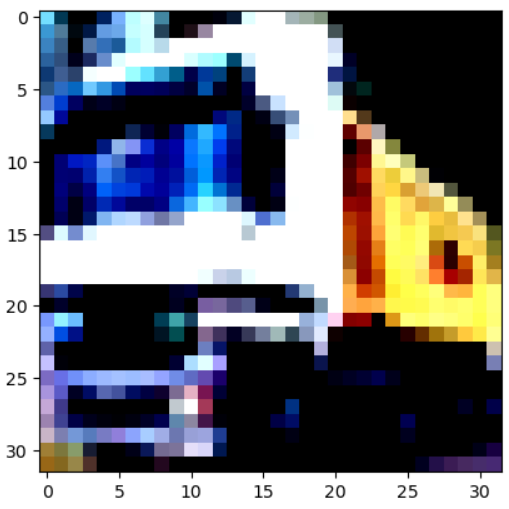
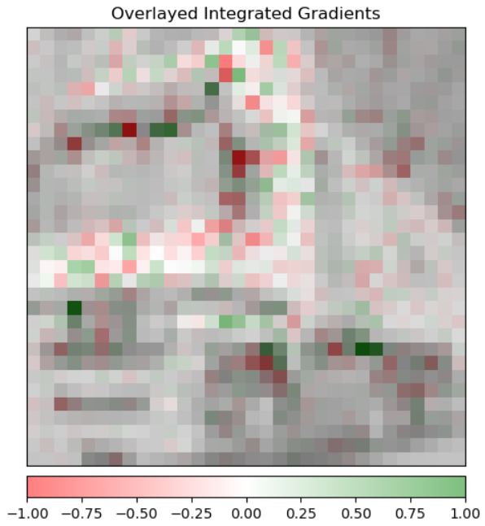

# EMLOv2 Assignment 08 Observations and Results
## Description:
This file aims to log and store the results and observations of serving a pytorch model as an API in a TorchServe environment. We have logged the correctness of output, their response times, the model explainability, metrics and performance logs.

## Pytest output:
```bash
========================================================== test session starts ==========================================================
platform linux -- Python 3.9.13, pytest-7.2.0, pluggy-1.0.0
rootdir: /home/ec2-user/emlov2-assignment8, configfile: pyproject.toml
plugins: anyio-3.6.2, hydra-core-1.2.0
collected 11 items

test_serve/test_api.py::test_api[127.0.0.1-cifar-0_frog.png] PASSED                                                                                    [  9%]
test_serve/test_api.py::test_api[127.0.0.1-cifar-1_truck.png] PASSED                                                                                   [ 18%]
test_serve/test_api.py::test_api[127.0.0.1-cifar-2_truck.png] PASSED                                                                                   [ 27%]
test_serve/test_api.py::test_api[127.0.0.1-cifar-3_deer.png] PASSED                                                                                    [ 36%]
test_serve/test_api.py::test_api[127.0.0.1-cifar-4_automobile.png] PASSED                                                                              [ 45%]
test_serve/test_api.py::test_api[127.0.0.1-cifar-5_automobile.png] PASSED                                                                              [ 54%]
test_serve/test_api.py::test_api[127.0.0.1-cifar-6_bird.png] PASSED                                                                                    [ 63%]
test_serve/test_api.py::test_api[127.0.0.1-cifar-7_horse.png] PASSED                                                                                   [ 72%]
test_serve/test_api.py::test_api[127.0.0.1-cifar-8_ship.png] PASSED                                                                                    [ 81%]
test_serve/test_api.py::test_api[127.0.0.1-cifar-9_cat.png] PASSED                                                                                     [ 90%]
test_serve/test_captum.py::test_captum[127.0.0.1-cifar] PASSED                                                                                         [100%]

=========================================================== slowest durations ===========================================================
0.19s call     test_serve/test_api.py::test_api[127.0.0.1-cifar-2_truck.png]
0.19s call     test_serve/test_api.py::test_api[127.0.0.1-cifar-3_deer.png]
0.18s call     test_serve/test_captum.py::test_captum[127.0.0.1-cifar]
0.07s call     test_serve/test_api.py::test_api[127.0.0.1-cifar-8_ship.png]
0.07s call     test_serve/test_api.py::test_api[127.0.0.1-cifar-0_frog.png]
0.06s call     test_serve/test_api.py::test_api[127.0.0.1-cifar-1_truck.png]
0.06s call     test_serve/test_api.py::test_api[127.0.0.1-cifar-5_automobile.png]
0.06s call     test_serve/test_api.py::test_api[127.0.0.1-cifar-9_cat.png]
0.06s call     test_serve/test_api.py::test_api[127.0.0.1-cifar-7_horse.png]
0.06s call     test_serve/test_api.py::test_api[127.0.0.1-cifar-6_bird.png]
0.06s call     test_serve/test_api.py::test_api[127.0.0.1-cifar-4_automobile.png]

(22 durations < 0.005s hidden.  Use -vv to show these durations.)
=========================================================== 11 passed in 3.94s ===========================================================
```

## Captum output:
### Image:


### IGs:


## Tensorboard output:
I ran into an issue here, tensorboard failed to log the runs of the pytorch_profiler even after following the same procedure :(


## Metrics output:
```bash
# HELP ts_inference_latency_microseconds Cumulative inference duration in microseconds
# TYPE ts_inference_latency_microseconds counter
ts_inference_latency_microseconds{uuid="8f82ff02-1c71-44a6-81af-5c173875db09",model_name="cifar",model_version="default",} 5939648.899000005
# HELP ts_queue_latency_microseconds Cumulative queue duration in microseconds
# TYPE ts_queue_latency_microseconds counter
ts_queue_latency_microseconds{uuid="8f82ff02-1c71-44a6-81af-5c173875db09",model_name="cifar",model_version="default",} 9619.636
# HELP ts_inference_requests_total Total number of inference requests.
# TYPE ts_inference_requests_total counter
ts_inference_requests_total{uuid="8f82ff02-1c71-44a6-81af-5c173875db09",model_name="cifar",model_version="default",} 66.0
```
